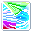

# VMatrix Core Images

Create VMatrix core images.

## The Pipelines

1. Extract skill icons from `Skill.wz` to `./img/skills` using [WzComparerR2](https://github.com/KENNYSOFT/WzComparerR2).
   - Check all skill icons are (32,32,4).
2. Extract the background, frame, mask, lock icons from `UI.wz/VMatrixUI.img` to `./img/VMatrixUI`.

   
   
   
   
   

3. Mask skill icons for each directions.

   
   →
   
   
   
4. Merge three masked skill icons. (left+right+up, 3-permutations)

   
   +
   
   +
   
   →
   
5. Add frame to merged images.

   
   +
   
   →
   
6. Add lock to merged images.

   
   +
   
   →
   


### Image File Structures

```tree
img
├─VMatrixUI
└─skills
   ├─Adele
   │  ├─comb+frame
   │  │  ├─Cleave+Eviscerate+Skewering.png
   │  │  ├─Cleave+Skewering+Eviscerate.png
   │  │  ├─Eviscerate+Cleave+Skewering.png
   │  │  └─ ...
   │  ├─comb+frame+lock
   │  │  ├─Cleave+Eviscerate+Skewering.png
   │  │  ├─Cleave+Skewering+Eviscerate.png
   │  │  ├─Eviscerate+Cleave+Skewering.png
   │  │  └─ ...
   │  ├─Cleave.png
   │  ├─Eviscerate.png
   │  └─ ...
   └─ ...
```

## TODO

- [ ] imagesearch from in-game screenshots
- [ ] find the valid combinations
